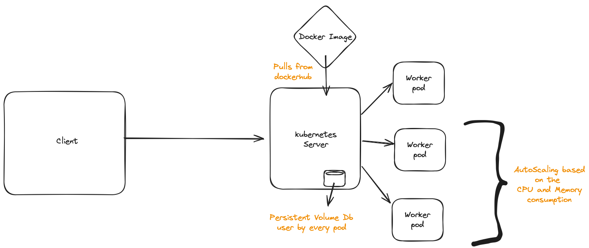

# Key-Value Store Application : Approach, Design Decisions, and Challenges

## System Design

### Approach

#### Technology Stack:

The choice of technologies for this Key-Value Store application was driven by the need for simplicity, scalability, and asynchronous task processing. The key components include:

FastAPI: Chosen for its fast performance, and built-in support for asynchronous programming.
Huey with Redis: Used for handling asynchronous tasks. Redis is employed as a message broker for Huey to ensure background task execution.

### Project Structure:
The project follows a modular structure:

app/
    - main.py: Contains the FastAPI application definition with endpoints for interacting with the key-value store.
    - tasks.py: Defines the Huey worker script responsible for executing background tasks asynchronously.
    - utils.py: Contains utility functions like getting data from db file and adding data.
database/
    - data.json: Stores all the key value pairs
k8s/: Houses Kubernetes manifests for deployment.
tests/ : Contains all the tests 
requirements.txt: Lists project dependencies.

### Design Decisions:

#### Asynchronous Task Processing:
FastAPI's support for asynchronous programming was leveraged to implement asynchronous background tasks using Huey. This design decision ensures that key-value operations, such as setting and deleting values, can be performed without blocking the main application thread.

#### Kubernetes Deployment:
The inclusion of Kubernetes manifests (k8s/) allows for easy deployment, scaling, and management of the Key-Value Store application. It includes services, persistent volume, deployments, and Horizontal Pod Autoscaler (HPA) for automatic scaling based on CPU utilization.

#### Simple RESTful API:
The design of the API prioritizes simplicity and consistency. The three main endpoints (GET /get/{key}, POST /set, and DELETE /delete/{key}) provide basic CRUD operations for the key-value store.

## Challenges:

#### Redis Configuration:
Ensuring proper configuration for connecting to the Redis server posed a challenge. Adjustments were made in both main.py and tasks.py to point to the correct Redis server, considering both local development and Kubernetes deployment scenarios.

#### Task Execution:
Integrating Huey for asynchronous task execution required careful attention to the worker script.

#### Kubernetes Database Management:
Not using an external database leads to more problems like every pod in Kubernetes must use only one file for Read and Writes. So user Persistent Volume for overcoming this problem.

## Conclusion:

The Key-Value Store application, built with FastAPI, Redis, and Huey, offers a simple yet powerful solution for storing and retrieving key-value pairs. The use of Kubernetes facilitates easy deployment and scaling, while the asynchronous task processing ensures efficient handling of background operations. Challenges encountered during development were addressed through careful configuration adjustments and a focus on understanding the interaction between components.

This project serves as a foundation for building scalable and responsive key-value store applications, demonstrating the power of modern Python frameworks and technologies.